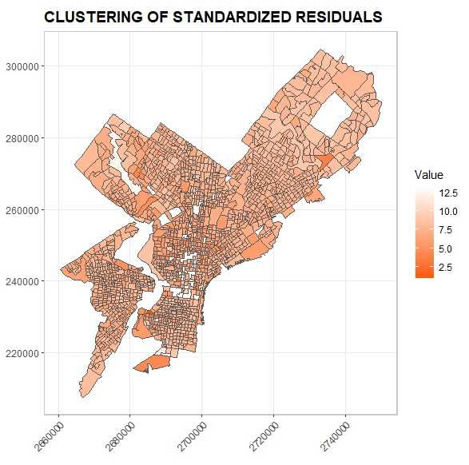
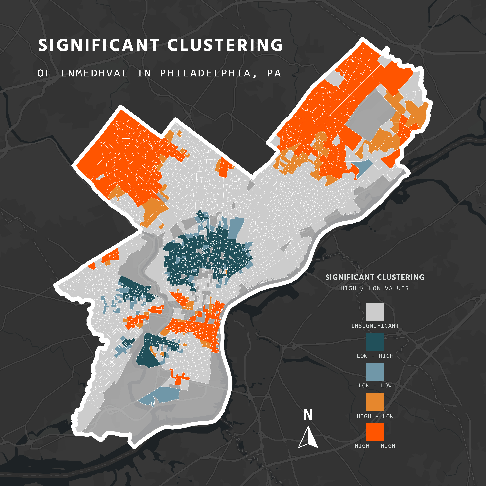
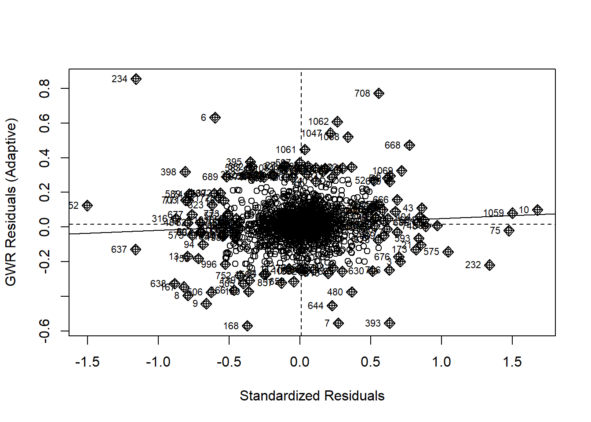
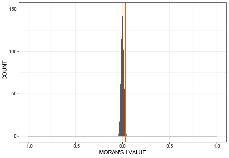
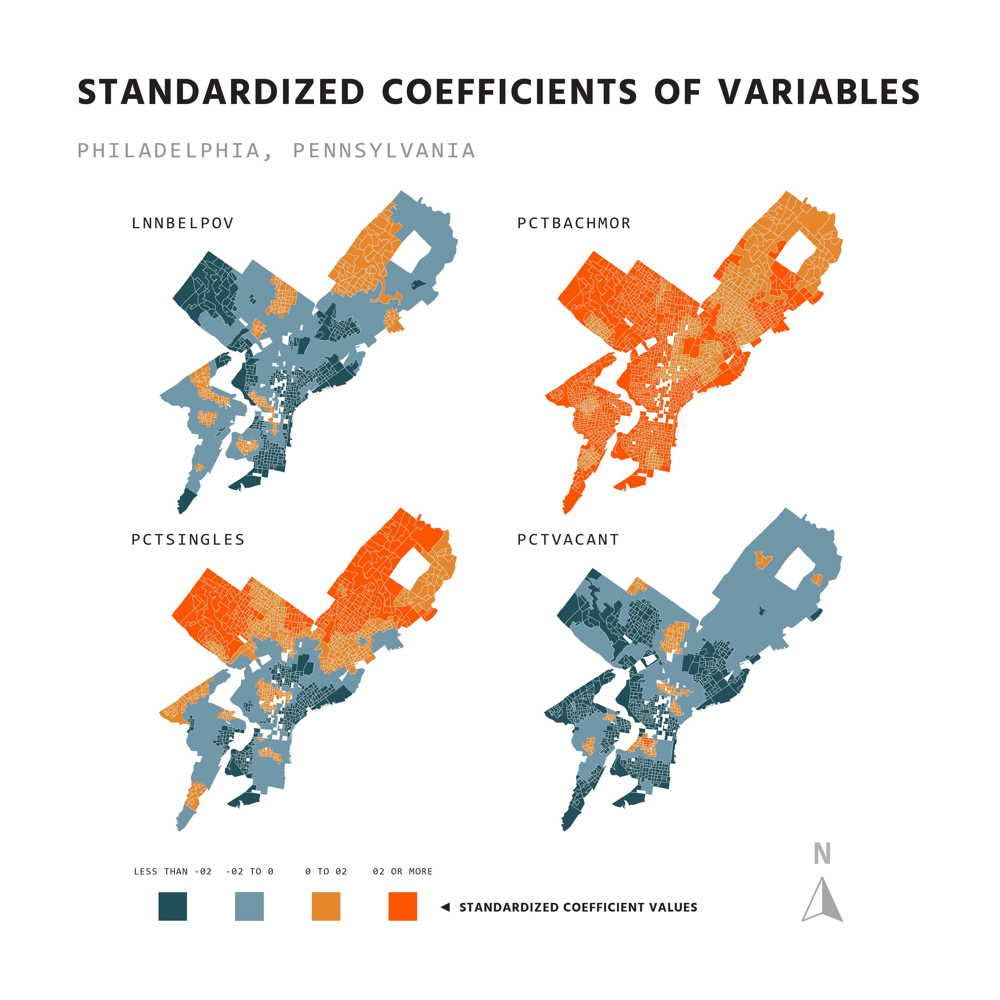
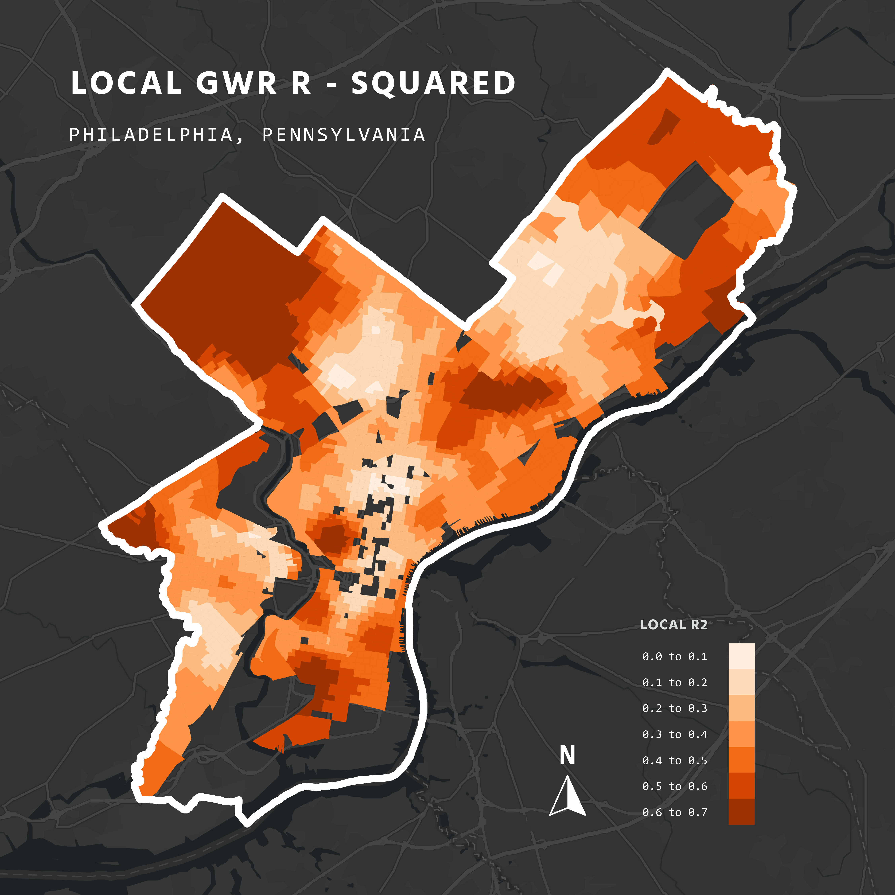

<br>

**Authors: Nohman Akthtari, Alec Jacobs, Trevor Kapuvari | 12.03.2023**

Course: Statistical And Data Mining Methods For Urban Spatial Analytics

<br>

```{r clear_environment, cache = TRUE, include = FALSE}

# Lists All Of The Objects In The Work Space

rm(list=ls())

```

```{r knitting_options, include = FALSE}

# Global Options For Knitting Chunks

knitr::opts_chunk$set(echo = T, cache = T, messages = F, warning = F, error = F)

```

```{r warning=FALSE, message=FALSE, cache=FALSE, include = FALSE}

# Loading In Project Specific Library Packages

options(scipen=999)
                 
library(sf)
library(spdep)
library(spgwr)
library(tmap)
library(spatialreg)
library(whitestrap)
library(lmtest)
library(tseries)
library(tidyverse)
library(gtsummary)
library(gt)
library(knitr)
library(kableExtra)

```

```{r color_palette, include = FALSE}

# Setting Specific Color Palettes For Visualizations

paletteV1 <- c("#FF5500", "#E6872D", "#FFA500", "#CAE4F1", "#7097A8", "#21505A")

paletteV4 <- c("#FF5500", "#FFA500", "#CAE4F1", "#7097A8", "#21505A")

paletteV3 <- c("#FF5500", "#FFA500", "#7097A8", "#21505A")

paletteV2 <- c("#e28743", "#eab676", "#eeeee4")

paletteV5 <- c("#FF5500", "#FFA500", "#CAE4F1", "#7097A8", "#21505A")

paletteV6 <- c("#FF5500", "#FFA500", "grey", "#7097A8", "#21505A")

```

```{r read_data, include = FALSE}

# Reading In Data Needed To Complete Assignment

shp <-st_read(dsn ="C:/Users/alecj/Desktop/HW02_Statistics_MUSA5000/RegressionData.shp")

```

# **INTRODUCTION** 

<br>

In our previous study, we employed Ordinary Least Squares (OLS) regression to examine the relationship between median home sales value by census block for homes in Philadelphia and four predictors: PCTBACHMOR (proportion of residents in a block group with at least a bachelor's degree), PCTVACANT (proportion of housing units that are vacant), PCTSINGLE (percent of housing units that are detached single family houses), and LNNBELPOV (natural log of the number of households living in poverty). While OLS regression is a common and powerful tool, it assumes that the data is randomly distributed in space. However, in many real-world scenarios, data exhibits spatial autocorrelation, meaning that nearby observations are more likely to be similar than observations that are farther apart. This can lead to biased and inefficient OLS estimates.

To address this issue, we employ three alternative modeling approaches in this study: spatial lag, spatial error, and geographically weighted regression (GWR). Spatial lag models account for spatial autocorrelation by incorporating the values of the dependent variable from neighboring observations into the regression equation. Spatial error models, on the other hand, assume that the residuals, rather than the dependent variable, are spatially autocorrelated. GWR, unlike OLS and spatial lag and error models, allows the regression coefficients to vary across space, reflecting the potential heterogeneity in the relationships between the predictors and the dependent variable.

Our primary objective is to assess whether these alternative models can offer improved capabilities in accounting for spatial autocorrelation compared to OLS. We will compare the performance of the models based on their goodness-of-fit statistics, spatial autocorrelation diagnostics, and the interpretability of their coefficients. Additionally, we will examine how the spatial models compare to each other in terms of their ability to capture the spatial variation in home sales values.

<br>

# **METHODOLOGY** 

<br>

## **SPATIAL AUTOCORRELATION AND MORAN'S I** 

<br>

The guiding principal of spatial statistics can be summarized well by the following quote:

$$
\textit{"Everything is related to everything else, but near things are more related than distant things.”}
$$
This quote was provided by Swiss geographer Waldo Tobler and referred to as the First Law of Geography.
The statistical translation behind Tobler's law is spatial autocorrelation, which can be derived from temporal autocorrelation. Temporal correlation means that values of a variable tend to be similar for time periods close together. We can translate the same idea into space. Given an aerial division of a two-dimensional space in polygons, we measure whether neighboring (or "close") locations have similar values with regard to our variable of interest or not. In case we observe such a trend, we speak of positive spatial autocorrelation. If not, we refer to the absence of spatial autocorrelation, or a negative spatial autocorrelation, indicating that neighboring (or "close") values exhibit repulsion by being significantly different.

There are several measures of spatial autocorrelation but most widely accepted is Moran's I. We first present the formula and its components and then present an explanation and interpretation.

Let there be an aerial polygon division of the observed two-dimensional space, and let $X$ be the variable of interest. Moran's I is then calculated as:

$$
I = \frac{1}{\sum_{i = 1}^{n} \sum_{j = 1}^{n}w_{ij}} \frac{\sum_{i=1}^{n}\sum_{j=1}^{n}w_{ij}(X_i - \overline{X})(X_j - \overline{X})}{\sum_{i = }^{n}(X_i - \overline{X})^2 / n},
$$
where $X_i, X_j$ are the observed values of the variable in polygons $i,j$ respectively, $\overline{X}$ is the mean of the variable, $w_{ij}$ is the weight indexing of location $i$ relative to location $j$, and $n$ is the number of observed aerial units. 

$w_{ij}$ is the $ij-$th entry in the contiguity weight matrix $W \in M_{n \times n}(\mathbb{R}),$ where $M_{n \times n}\mathbb{R}$ is the vector space of $n \times n$ matrices with entries in $\mathbb{R}.$ The contiguity weight matrix codes spatial proximity into spatial weights. Each contains all combinations of a given aerial unit with the $n$ aerial units in question and the associated weights. It is best practice to row-standardize $W$ because this will cancel out the first fraction in the equation above.

Whether locations $i,j$ are neighbors depends on whether $w_{ij}$ is non-zero, which in turn depends on the choice of type of $W.$ whereas there are distance-based approaches for $W,$ the standard literature usually prefers the so-called Queen contiguity matrix. The name derives from the allowed moves of the queen on a chessboard and visually translates into the notion that each location $j$ that shares a border with location $i$ is defined as a neighbor, implying $w_{ij} \not= 0.$ Hence, non-neighboring locations are effectively cut out of the presented formula. For the rest of our study, we will employ the Queen contiguity method.

It becomes evident that statistical work employing Moran's I could be sensitive on the choice of $W$ to a degree of invalidating results. Therefore, many statisticians show the robustness of their results by demonstrating  the results hold for other types of $W,$ too. With the above explanations and the definition of the Pearson correlation coefficient in our previous assignment, we see that Moran's I is a standardized number between $-1$ and $1$ measuring how much neighboring values of $X$ co-vary relative to the overall variation in $X$. $X$ is the term in the denominator of the second fraction in the presented formula. A value close to 1 indicates strong positive spatial correlation, denoting clustering of values in nearby locations. A value close to -1 indicates negative spatial correlation. Thus, implying repulsion of values in nearby locations.

<br>

### **MORAN'S I SIGNIFICANCE TEST** 

<br>

A way of significance testing for Moran's I is by randomly permuting the observed values of our variable $X$ and thereby assigning each location $i$ a potentially new value.

We first introduce the algorithm to obtain values for our Moran's I significance test. Then, we introduce pseudo p-values and the significance test, and end by giving an interpretation on the employed method.  

We denote our original Moran's I value as $\text{Moran}_{\text{initial}}.$ and follow with a random permutation - calculating Moran's I for our first permutation. We then repeat this process another 998 times and rank the 999 test results in addition to $\text{Moran}_{\text{initial}}$ in descending order. Now, let $\text{rank}(x_i), i \in [0, 1000]$ return the relative position of the $x_i-$th permutation in the ordered set. Since there exists an $i'$ such that  $x_i = \text{Moran}_{\text{initial}},$ we can then calculate the so-called pseudo p-value by computing

$$
p = \frac{\text{rank}(\text{Moran}_{\text{initial}})}{1000}.
$$

For our hypothesis test, we have the following statements:

\[
H_0: \text{There is no spatial autocorrelation.}
\]

\[
H_{a_1}: \text{There is positive spatial autocorrelation.}
\]

\[
H_{a_2}: \text{There is negative spatial autocorrelation.}
\]

In case the pseudo p-value is less than 0.05, we can reject the null hypothesis of no spatial autocorrelation for either $H_{a_1}$ or $H_{a_2}.$ In case $\text{Moran}_{\text{initial}}$ is positive, we can reject $H_{a_2}$ and will fail to reject $H_{a_1},$ and vice versa.

In simple terms, given a set of values of $X$ for each aerial unit for a polygon division of a two-dimensional space, random permutation recalculates Moran's I  with the same contiguity weight Matrix $W$ for each permutation. This produces meaningful values for our significance test to work with since it shows the relative extremeness of $\text{Moran}_{\text{initial}}.$ Our hypothesis test with the three presented outcomes is then evaluated via the pseudo p-value with the standard threshold of 0.05, where the pseudo p-value is the probability to observe a value that is equal to or more extreme than $\text{Moran}_\text{initial}.$

If the pseudo p-value is greater than that of our Moran's I, we fail to reject $H_0$. This implies a condition of no spatial autocorrelation. Conversely, if the pseudo p-value associated with our Moran’s I test is lower than the predetermined significance level (typically set at 0.05), we reject the null hypothesis $H_0$ in favor of the alternative. This rejection indicates that we have statistically significant clustering in space.

<br>

### **LIMITATIONS OF MORAN'S I** 

<br>

For Moran's I, in all of the above constructions, we assumed a given division of two-dimensional space. However, the value of Moran's I is dependent on the choice of division. This means that Moran's I is not canonical. In geographic terms, there is a modifiable aerial unit problem inherent in the measure. One popular application of this is the phenomenon of gerrymandering. As mentioned, the choice of $W$ can also change the results of spatial analyses. Edge aerial units by definition don't have a "full" neighborhood, a constraint that can significantly affect the results especially if the weights to the right of border aerial units are high in $W.$ On the other hand, aerial units could have largely differing amounts of neighbors, again qualifying the generalizability of the measure. 

Further, patterns such as the total division between high and low values between two halves of a map result in nearly no spatial autocorrelation, even though it practically is high. Only random shuffling significance tests would show us that something is off with the Moran's I for these cases. Additionally, some choice of a random variable $X$ suffer under the constraint of non-uniformity in space. For example, bank robberies can only occur in banks. Ultimately, Moran's I is a global measure that does not reveal the source of a high or low value given we don't know which areas of our space contribute to the degree of our Moran's I. For this reason, it often makes sense to visualize local indices of spatial autocorrelation (LISA).

<br>

## **SPATIAL LAG** 

<br>

### **LISA** 

Conceptually, LISA is similar to Moran's I but instead of measuring the global spatial autocorrelation, it measures the extent values of $X$ at sites $i$ are related to values of $X$ at neighboring sites. The formula for LISA is given by 

$$
I_i =\frac{1}{\sum_{j = 1}^{n}w_{ij}} \frac{(X_i - \overline{X}) \sum_{j=1}^{n}w_{ij}(X_j - \overline{X})}{(X_i - \overline{X})^2 / n},
$$
and we see that the LISA statistic is proportional to Moran's I in that the Moran's I is the mean of the set $I_i$ where $i$ is defined such that all locations of our spatial division are included. 

<br>

### **LISA SIGNIFICANCE TEST** 

<br>

The procedure for the LISA significance test is equal to the one for the Moran's I metric, but is conducted for a location $i$ instead of the whole data set. It is noteworthy that when we reshuffle for a particular location $i,$ we do so for each of the $j$ neighbors but not for $i$ itself. Our hypotheses test are:

\[
H_{i_0}: \text{There is no spatial autocorrelation at location } i.
\]

\[
H_{i_{a_1}}: \text{There is positive spatial autocorrelation at location } i.
\]

\[
H_{i_{a_2}}: \text{There is negative spatial autocorrelation at location } i.
\]

The interpretations are equal to those given for the Moran's I value, but constrained to a location $i.$

<br>

## **OLS REGRESSION** 

<br>

### **OLS REGRESSION: EXPLANATION & ASSUMPTIONS** 

<br>

Multiple regression analysis is a statistical technique that inputs k independent variables to identify the unique surface in k+1 that minimizes the sum of squared residuals from our dependent variable observations. A residual is the shortest distance in k+1 dimensions from the best fit surface to the true observed data point in the dependent variable. Given that all assumptions for a Multiple Linear Regression are fulfilled, the core idea is that given our historic data on our k independent variables, the best fit surface will be a reliable and robust predictor for future values of the dependent variable. In standard statistical literature terminology, we say that we have a good regression model if our k independent variables 'explain' much of the variation, that is, if our best fit surface is close to the observation of the dependent variable for each observation.

In order to use Multiple Regression Analysis, we have to ensure that all assumptions are met:

1. Linearity

2. Normality of residuals

3. Homoscedasticity of residuals

4. No multicolinearity

5. Continuity of dependent variable 

6. Residuals are random

7. Assumption of independence

For a detailed explanation of OLS regression and its underlying assumptions, please refer to our previous assignment. In the results section of the aforementioned paper, we observed a common occurrence wherein data with spatial components exhibited clustering in the residuals. Notably, we consistently underestimated high logged median household values while overestimating low household values. Visualizing the residuals of the OLS regression often helps identify data with such spatial components. Below, a map of standardized residuals illustrating the clustering phenomenon:


The presence of clustered standardized errors signals the existence of an unaccounted spatial process. Simply put, the seemingly random noise conceals pertinent information crucial for evaluating the efficacy of our Ordinary Least Squares (OLS) regression. Consequently, the assumptions of homoscedasticity and independence of residuals are compromised, thereby violating key tenets of our regression analysis. Furthermore, the significance values associated with the $\beta$ coefficients may be artificially inflated. An alternative method for detecting spatial autocorrelation involves regressing the residuals of the OLS model against the lagged neighboring residuals. This technique, clarified in the subsequent subsection, yields $\beta$ coefficients termed as "b slope" for the lagged residuals.

<br>

## **SPATIAL LAG & SPATIAL ERROR REGRESSION**

<br>

Several methods exist to address a spatial process in our dependent variable $X.$ Initially, we will introduce spatial lag and spatial error, followed by an exploration of geographically weighted regression. All spatial lag and spatial error models will be executed using the R software.

<br>

### **MOTIVATION**

<br>

A spatially lagged variable is the average of that value at those aerial units identified as neighbors by the contiguity weight matrix $W.$ Applying this to the previous section, if we were to see a significant relationship between our residuals and lagged residuals, the assumption of independence of residuals would be violated. This also implies that $\beta$ coefficients and their significance values may be inaccurate as they are inflated, which was discussed in the previous section. The goal of both spatial lag and spatial error regression is to remove these spatial dependencies in the residuals and to induce less heteroscedasticity.

<br>

### **ASSUMPTIONS & FORUMLAE**

<br>

Both types of regressions, along with all OLS regression assumptions except for the independence of residuals, posit that the dependent variable in one location is linked to the values of that variable in nearby locations. We retain the assumption of independence of residuals, as it represents a factor we seek to address. Both models look to remedy this by incorporating an additional predictor.

We have given two tests for identify spatial dependencies, one visual and one that regresses residuals on lagged residuals. The reader might now ask himself if there are any fixed cut-off values after which one can be sure to use spatial lag or spatial error models. Whereas such a value doesn't exist, we usually recommend running both OLS regression and spatial lag or spatial error regression if in doubt and compare the results on a number of criteria. We will discuss this in more detail in section "Spatial Lag vs OLS Regression" and "Spatial Error vs OLS Regression."

<br>

### **SPATIAL LAG REGRESSION**

<br>

Spatial lag ideally corrects the OLS model by including the lagged variable as an "independent variable" into the regression:

$$
y = \rho Wy + \beta_0 + \beta_1X_1 + \ldots + \beta_nX_n + \epsilon
$$
where $\rho$ is the lag error parameter of the $y-$lag variable $Wy.$ As such, $\rho$ can take values between -1 and 1. As $y$ is the output of our first OLS regression, spatial lag can be seen as a two-step regression model. Note: the new summand in the formula is a new predictor that ideally includes information of the spatial dependencies that previously were contained in the error term $\epsilon.$ This, however, is not necessarily always the case. $\rho$ can intuitively be interpreted as the coefficient to the $y$-lag variable $Wy.$ The interpretation of $\beta$ coefficients in the spatial lag model is complicated and not equivalent to that in spatial error and OLS regression. Therefore, we will just interpret the spatial lag depending on whether the value is positive or negative. Positive values indicate positive autocorrelation, and vice versa.

<br>

### **SPATIAL LAG VS OLS REGRESSION**

<br>

In case our added corrective variable $W_name$ is significant with $p < 0.05,$ we can say that our dependent variable has a special process, as it demonstrates a significant correlation with adjacent values of the independent variable. It is essential to note that the inclusion of this corrective variable not only tends to alter parameters such as the intercept or coefficients but also affects the significance levels associated with each. In examining heteroscedasticity, which is linked to the independence of errors, we employ three testing methods: the White Test, the Breusch-Pagan Test, and the Koenker-Bassett Test. These tests help assess the presence of heteroscedasticity in our model, providing valuable insights into the variance structure of the residuals.

1. White Test: This test serves as both a heteroscedasticity-consistent covariance matrix estimator and an evaluator of heteroscedasticity, without necessitating a predefined form for the alternative hypothesis regarding changing variances. In contrast to the Breusch-Pagan test, the White Test exhibits a broader applicability, making it a versatile tool for detecting and addressing heteroscedasticity in regression models. Its flexibility allows for a more comprehensive assessment of variance structures, contributing to the robustness of our statistical analysis.

2. Breusch-Pagan Test: For the assessment of both heteroscedasticity and random coefficient variation, this test derives its test statistic by computing the squared residuals from the OLS regression model. In this process, the test scrutinizes the variance of the residuals by contrasting it with the variance predicted by a supplementary regression model. This auxiliary model utilizes the same independent variables employed in the original model to forecast the squared residuals. By comparing these variances, the test provides valuable insights into the presence and nature of heteroscedasticity and random coefficient variation within the regression framework, enhancing our understanding of the model's performance.

3. Koenker-Basset Test: A modified version of the Breusch-Pagan test, this variant considers the potential impact of individual data points on the assessment of heteroscedasticity. Notably, a high value for this statistic not only signals the presence of heteroscedasticity but also suggests a correlation between the variance of the residuals and the magnitude of the predicted values. This nuanced perspective enhances the diagnostic capability of the test, providing a more comprehensive understanding of the interplay between individual data points and the variability in the model's predictions.

<br>

### **AKAIKE INFORMATION CRITERION (AIC) / SCHWARTZ CRITERION (SC)**

<br>

AIC and SC are measures of the goodness of fit of an estimated statistical model. These measures act as relative indicators, quantifying the information lost when employing a particular model to represent reality. Essentially, they capture the delicate balance between the precision and complexity of the model, providing valuable insights into the model's efficacy in capturing essential patterns while avoiding overfitting. The AIC is given by:

$$
\text{AIC} = -2\log (p(y \mid \omega_{ML}))+2K 
$$
where y is some event and $\omega_{ML}$ is the value that maximizes the likelihood function for $y.$ Then $p(y \mid \omega_{ML})$ is the maximized value of the likelihood function for the model. It becomes evident that when comparing models, more negative models have a better goodness of fit due to their greater maximized value of their likelihood function. The SC is related to the AIC but the AIC is usually preferred to predictive models whereas the SC is used for more parsimonious models. This is because the AIC favors models that that most adequately describe an unknown while the SC tries to find a true model in a set of candidates. Therefore, AIC and SC allow us to compare spatial lag with spatial error.

<br>

### **LOG LIKELIHOOD**

<br>

The log likelihood method uses the maximum likelihood method of determining the best fitting data given the parameters of a statistical model, where a higher value indicates a better fit. We are only able to use log likelihood to compare nested models – the OLS regression model is a nested version of the spatial lag and spatial error regression models that does not include the spatial lag or spatial error terms. We can compare our OLS model to each spatial regression separately, but we are unable to compare the spatial regressions to each other using the log likelihood criteria.

<br>

### **LIKELIHOOD RATIO TEST (LRT)**

<br>

The LRT assesses the goodness of fit between two nested models:

$$
H_0: \text{Log-Likelihood Standard OLS Reg.  - Log-Likelihood Spatial Lag Reg. = 0.} \\
H_A: \text{Log-Likelihood Standard OLS Reg. - Log-Likelihood Spatial Lag Reg.} \not= 0.
$$
Models are nested if one two models have the same dependent variable but one of the model has the same and potentially more independent variables. As we see in the formula for spatial lag regression, we see that OLS regression is nested within spatial lag regression where $\rho = 0.$ The likelihood function of a model is the probability that we actually observe the values of dependent variable $X$ given our $\beta$-coefficients. The log-likelihood function is the logarithm of the likelihood function for a given model. Provided this information above, the hypotheses tests start to make sense since in case we reject $H_0,$ this would imply that one set of coefficients is significantly better than the other in predicting the observed values of $X.$ 

Since adding the spatial process usually significantly increases the accuracy of a model (given that there is spatial autocorrelation), we usually reject $H_0$ for $p < 0.05$ and state that the spatial lag is a more predictive model than the standard OLS model. LRT can be seen an evaluation that assesses whether our additional variable actually improved the model in terms of accuracy or not. With regards to the spatial lag regression, the LRT is hence a test whether our new "predictor" $\rho Wy$ absorbed some effect of the spatial process in the error term of the normal OLS regression. Note: LRT penalizes models that are more complex (e.g. have more independent variables) but yield the same goodness of fit as a nested model with fewer independent variables. Furthermore, we cannot compare spatial lag and spatial error regression with LRT since these models are not nested.

<br>

### **SPATIAL ERROR REGRESSION**

<br>

Spatial error is a two-step regression model that ideally corrects the OLS model by splitting the error term $\epsilon$ into random noise and the spatially lagged residual:

$$
y = \beta_0 + \beta_1X_1 + \ldots + \beta_nX_n + \lambda W \epsilon + \mu
$$
where $\mu$ is the random noise, $\lambda W \epsilon$ is the spatially lagged residual with the lag error parameter $\lambda \in [-1, 1],$ and $\epsilon = \lambda W \epsilon + \mu.$ We get $\epsilon$ by regressing residuals on the residuals of neighbors as defined by $W.$ This is the second step in the two-step regression process and in the best case extracts the spatial dependencies into the spatially lagged residual $\lambda W \epsilon.$ Note that $\lambda W \epsilon$ now is a predictor in our model. $\lambda$ can intuitively be interpreted as the coefficient of the spatially lagged residual $W \epsilon.$

Our respective beta coefficients in the above formula are the solutions to the optimization problem in the multiple regression equation presented in our first analysis. There is exactly one beta coefficient for each independent variable. Beta coefficients are unit-free and the sign of the beta coefficient indicates whether relationship between the dependent and independent variable is positive or negative in the context of our regression model. Intuitively, a beta coefficients tell us by how much the value the dependent variable increases when the predictor $i$ goes up by one unit and all other predictors are kept equal. As such, the beta coefficient can be thought of a strength relationship between dependent and independent variable in the context of our regression model. The $\beta$ coefficients are statistically significant if the values fall below the p-threshold. Intuitively, the above also holds for the coefficient $\lambda.$

<br>

### **SPATIAL ERROR VS. OLS REGRESSION**

<br>

Everything that we explained for Spatial Lag vs OLS Regression also holds for spatial error regression. Again, OLS regression is nested within spatial error regression with $\lambda = 0.$

<br>

### **CHOOSING BETWEEN SPATIAL LAG & ERROR REGRESSION**

<br>

The choice of whether or not to use a spatial regression model depends on the outcome of the Lagrange Multiplier (LM) test. If neither the LM test for spatial lag nor the LM test for spatial error is significant, then OLS regression is sufficient, and no spatial regression model is needed. However, if one or both of the LM tests are significant, then a spatial regression model should be used.

If only one of the LM tests is significant, then the spatial regression model type corresponding to that significant test should be used. For example, if the LM test for spatial lag is significant but the LM test for spatial error is not, then a spatial lag model should be used.

If both the LM test for spatial lag and the LM test for spatial error are significant, then the decision of which spatial regression model type to use is based on the Robust LM values and probabilities. The spatial regression model type with the lower p-value or higher test statistic should be chosen.

<br>

## **GEOGRAPHICALLY WEIGHTED REGRESSION**

<br>

For spatial lag and spatial error regressions as well as for the OLS regression, we have one consequential constraint - all of our predictors are globally stationary given that regardless of the location $i,$ we apply the same coefficients to estimate a value for our dependent variable $X.$ The idea that the modeled relations are constant throughout space (e.g. the study area) is called spatial stationarity, which does not always hold. One likely consequence of spatial stationarity could be spatial clustering in the residuals as we saw in the previous paper, assuming that close neighborhood effects are a more accurate and significant predictor of nearby values. This notion is also consistent with Tobler's First Law of Geography. 

A good way to illustrate the above is Simpson's Paradox. Simpson's Paradox is a phenomenon in statistics in which a trend appears in several groups but disappears or reverses when aggregating all groups into one. The reason this can happen is because even though some parts of the data might have a very clear trend, the aggregation process can even out many of these effects or even reverse them. This is something that likely happens to spatially constant coefficients and might ultimately lead to spatial clustering. One way to avoid these issues altogether is using local regression. Local regression runs a OLS regression for each location $i$ and points in the data set that are considered "spatially close". We will later see that we define this notion of spatial closeness through bandwidths. In GWR, data from locations farther away are given less weight, thereby increasing the effect of direct neighbors on the regression estimates for location $i.$ Therefore, location regression is specific for a location $i$ and employs the idea behind Tobler's First Law of Geography.

<br>

### **GWR FORMULA & ASSUMPTIONS**

<br>

The equation for GWR is: 

$$
y_i = \sum_{k = 1}^{m} \beta_{ik}x_{ik}+ \epsilon_i
$$
where $\beta_{ik}$ is the $i$-th location specific $\beta$-coefficient, $x_{ik}$ is a data point that is considered spatially close to $i,$ and $\epsilon_i$ is the $i$-th location specific residual. GWR has the same assumptions has spatial lag and spatial error. Ideally, the data set includes at least 300 observations.

<br>

### **FIXED BANDWIDTH & ADAPTIVE BANDWIDTH**

<br>

In local regression, the concept of "spatially close" is crucial for determining the weights assigned to neighboring observations when estimating the value at a specific location $i$. This definition of spatial proximity is typically represented by a bandwidth, which defines the maximum distance or the number of neighboring observations considered when fitting the local regression model.

Two primary approaches exist for defining the bandwidth: fixed and adaptive. A fixed bandwidth specifies a predetermined distance threshold for all locations. Observations falling within this distance are considered neighbors and contribute to the local regression at the target location. Conversely, an adaptive bandwidth dynamically adjusts the distance threshold based on the local density of observations. This approach ensures that a consistent number of neighbors are considered for each location, regardless of the overall spatial distribution of data points.

The choice of bandwidth type, whether fixed or adaptive, can significantly impact the local regression outcome. A fixed bandwidth may lead to overfitting or underfitting in areas with sparse or dense data points, respectively. On the other hand, an adaptive bandwidth can adapt to varying data densities, potentially providing more consistent results across the study area.

In addition to influencing the spatial extent of neighboring observations, the bandwidth also determines the weighting function used in local regression. The weighting function assigns decreasing weights to observations as their distance from the target location increases. The specific form of the weighting function depends on the chosen bandwidth type and the desired smoothness of the local regression estimate.

Ultimately, the selection of an appropriate bandwidth is a crucial aspect of local regression modeling. The choice between fixed and adaptive bandwidths depends on the specific characteristics of the data and the research question being addressed. Careful consideration of the bandwidth's impact on both the spatial extent of neighbors and the weighting function is essential for obtaining reliable and interpretable local regression results.

The fixed bandwidth technique has a Gaussian distribution, and one way to define it would be 

$$
w_{ij} = e^{-0.5(\frac{\text{distance}_{ij}}{h})^2}.
$$
where $h$ is the bandwidth distance and $\text{distance}_{ij}$ is the distance between location $i,j.$ A Gaussian distribution makes sense here since we don't discriminate locations by the number of data points in the neighborhood of a point and therefore apply the same weighting distribution to each location. For a variable bandwith, the weighting function should be such that its distribution attributes higher weights than the Gaussian distribution to close points but $w_{ij}$ rapidly decreases as distance increases. This is important since we do not know in advance the number of close data points we can capture and therefore have to give disproportionately high weights to close neighbors. If we do not do this, we would allow potentially very far points to have disproportionately high impact on our prediction. 

<br>

### **GWR LIMITATIONS**

<br>

One of the big limitations of GWR is that since we work with subsets of the dependent variable $X,$ we are more likely to encounter local multicolinearity for our local regressions. Note that local multicolinearity does not imply global multicolinearity. Also, smaller sample sizes make it more difficult to detect a significant relationship between explanatory variables an a dependent variable. Additionally, explanatory variables in local regression are at risk insignificance since they are likely to have a very uniform distribution for the area within a bandwidth. We also have the multiple test problem in that we would need extremely many tests to determine significance of coefficients. With the multiple test problem also comes the issue of that we will have many Type I errors, even with low thresholds. The multiple test problem is also why we don't have p-values associated to GWR.

<br>

# **RESULTS** 

<br>

## **HISTOGRAMS / LOG TRANSFORMATIONS**

<br>

The provided histograms illustrate the distribution of all raw variables: MEDHVAL, PCBACHMORE, PCTVACANT, PCTSINGLES, NBELPOV100, and MEDHHINC. It is crucial to observe that variables such as PCTBACHMOR, PCTVACANT, PCTSINGLES, and NBELPOV100 exhibit a skewed distribution - indicating the need for log transformation before conducting additional analyses. The skewed distribution of these variables may impact the assumptions of normality in statistical analyses. Log transformation is a common practice to address skewness, helping to stabilize variances and improve the adherence of the data to normal distribution assumptions. Additionally, this transformation aids in mitigating the influence of extreme values, contributing to more robust and reliable analyses. It is also essential to ensure that the data conforms to the assumptions of the chosen statistical methods, as deviations from normality can affect the accuracy of parameter estimates and hypothesis testing. Therefore, applying log transformation to these variables is an important step in preparing the data for rigorous and valid statistical analysis. Note: certain regression techniques yield more valid results when applied to normally distributed data. Therefore, transforming these variables using a logarithmic scale is recommended to enhance the accuracy and reliability of subsequent analytical procedures.

```{r}

par(oma=c(0,0,2,0)) 
par(mfrow=c(2,3)) 
hist(shp$PCTBACHMOR, breaks = 40, col = "#FF5500",
     main = "% of Pop with
     a Bachelor Degree or Higher",
     xlab = "PCTBACHMOR",
     border = "white",
     lwd = 0.1)
hist(shp$MEDHHINC, breaks = 50,col = "#FF5500",
     main = "Median Household Income",
     xlab = "MEDHHINC",
     border = "white",
     lwd = 0.1)
hist(shp$PCTVACANT, breaks = 40,col = "#FF5500",
     main = "% Units Marked as Vacant",
     xlab = "PCTVACANT",
    border = "white",
     lwd = 0.1)
hist(shp$PCTSINGLES, breaks = 40, col = "#FF5500",
     main = "% of Units Marked 
     as Single Family",
     xlab = "PCTSINGLES",
     border = "white",
     lwd = 0.1)
hist(shp$MEDHVAL, breaks = 50,col = "#FF5500",
     main = "Median House Value",
     xlab = "MEDHVAL",
     border = "white",
     lwd = 0.1)
hist(shp$NBelPov100, breaks = 50,col = "#FF5500",
     main = "# of Households Below Poverty",
     xlab = "NBelPov100",
     border = "white",
     lwd = 0.1)

```

<br>

## **HISTOGRAMS / LOG TRANSFORMED VARIABLES**

<br>

Before proceeding with the transformation, it is crucial to identify variables with a minimum value of 0. Specifically, PCTBACHMOR, PCTVACANT, PCTSINGLES, and NBELPOV100 fall into this category. To ensure the accuracy of the transformation process, it is essential to add 1 to these variables that reach the minimum value of 0 before applying any further transformations. Hence, PCTBACHMOR, PCTVACANT, PCTSINGLES, and NBELPOV100, all with minimum values of 0, must be increased by 1 prior to undergoing the transformation process. This precautionary step is critical for preventing undefined results and ensuring the integrity of subsequent analytical procedures. The minimum values include PCTBACHMOR: 0, MEDHHINC: 2499, PCTVACANT: 0, PCTSINGLES: 0, MEDHVAL: 10000, BBELPOV100:0. The adjustment of variables with a minimum value of 0 by adding 1 is a standard practice in data preprocessing. 

```{r}

shp$Log_MEDHHINC <- log(shp$MEDHHINC)
shp$Log_MEDHVAL <- log(shp$MEDHVAL)

#log transformation +1
shp$Log_PCTBACHMOR <- log(shp$PCTBACHMOR + 1)
shp$Log_PCTVACANT <- log(shp$PCTVACANT + 1)
shp$Log_PCTSINGLES <- log(shp$PCTSINGLES + 1)
shp$Log_NBelPov100<- log(shp$NBelPov100 + 1)

par(oma=c(0,0,2,0)) 
par(mfrow=c(2,3)) 
hist(shp$Log_PCTBACHMOR, breaks = 40, col = "#FF5500",
     main = "Log Trans. of % Pop 
     with Bach. Degree or Higher",
     xlab = "LNPCTBACHMOR",
     border = "white",
     lwd = 0.1)
hist(shp$Log_MEDHHINC, breaks = 50,col = "#FF5500",
     main = "Log Trans. of 
     Median Household Income",
     xlab = "LNMEDHHINC",
     border = "white",
     lwd = 0.1)
hist(shp$Log_PCTVACANT, breaks = 40,col = "#FF5500",
     main = "Log Trans. of 
     % Units marked as Vacant",
     xlab = "LNPCTVACANT",
     border = "white",
     lwd = 0.1)
hist(shp$Log_PCTSINGLES, breaks = 40, col = "#FF5500",
     main = "Log Trans. of % Units
     Marked as Single Family",
     xlab = "LNPCTSINGLES",
     border = "white",
     lwd = 0.1)
hist(shp$Log_MEDHVAL, breaks = 50,col = "#FF5500",
     main = "Log Trans. of the
     Median House Value",
     xlab = "LNMEDHVAL",
     border = "white",
     lwd = 0.1)
hist(shp$Log_NBelPov100, breaks = 50,col = "#FF5500",
     main = "Log Trans. of the
     # of HH Below Povery",
     xlab = "LNNBelPov100",
     border = "white",
     lwd = 0.1)
```

<br>

## **DEFINING NEIGHBOR RELATIONSHIPS**

<br>

The premise of spatial autocorrelation centers around Tobler's First Law of Geography. Articulated by Waldo Tobler in 1969, the law posits "everything is related to everything else, but near things are more related than distant things." It suggests objects/phenomena that are geographically close to one another are more likely to be similar, or have a spatial relationship when compared objects that are farther apart. The first law of geography is the foundation of the fundamental concepts of spatial dependence and spatial autocorrelation - utilized specifically for the inverse distance weighting method of spatial interpolation and supports the regionalized variable theory for kriging. Ultimately, Tobler's law is a fundamental assumption applied in all spatial analysis. 

Therefore, we begin by defining neighbors for each of the block groups in Philadelphia. A polygon (in this case, block group) is considered to have a “Queen Neighbor Relationship” to another polygon if they share either a side and/or a vertex. This is compared to a “Rook Neighbor Relationship,” where two block groups only share a side. Neighbors based on contiguity are constructed by assuming that neighbors of a given area are other areas that share a common boundary. Neighbors can be of type Queen if a single shared boundary point meets the contiguity condition, or Rook if more than one shared point is required to meet the contiguity condition. We’ll prepare a weight matrix based on Queen neighbors, and visualize the connections between neighbors based on the weight matrix.

<br>

```{r queen_neighbors}

# Producing Queen Neighbor Relationship Outputs

queen<-poly2nb(shp, row.names=shp$POLY_ID)

summary(queen)

```

```{r neighbor_connections, include = TRUE, fig.keep = "none"}

# Visualize Connections Between Neighbors Based On Weight Matrix

reg_data_lines = nb2lines(queen, 
                          coords = st_centroid(shp$geometry), 
                          as_sf = TRUE)

tm_shape(shp) + 
  tm_borders(col = 'grey80', lwd = 0.5) + 
tm_shape(shp) +
  tm_dots() +
tm_shape(reg_data_lines) +
  tm_lines(col = '#FF5800') +
tm_layout(frame = FALSE)

```


```{r visualizing_neighbors}

# Visualizing Which Block Groups Have Only One Neighbor

smallestnbcard<-card(queen) 
smallestnb<-which(smallestnbcard == min(smallestnbcard))
fg<-rep('grey95', length(smallestnbcard))
fg[smallestnb]<-'#FF5800'
fg[queen[[smallestnb[1]]]]<-"#E6872D"
fg[queen[[smallestnb[2]]]]<-"#E6872D"
fg[queen[[smallestnb[3]]]]<-"#E6872D"
fg[queen[[smallestnb[4]]]]<-"#E6872D"
plot(shp$geometry, col=fg, lwd=0.5, border='grey80')
title(main='BLOCK GROUPS WITH ONLY 01 NEIGHBOR')

# Visualizing Which Block Groups Have The Most Neighbors

largestnbcard<-card(queen)
largestnb<-which(largestnbcard == max(largestnbcard))
fg1<-rep('grey95', length(largestnbcard))
fg1[largestnb]<-'#FF5800'
fg1[queen[[largestnb]]]<-"#E6872D"
plot(shp$geometry, col=fg1, lwd=0.5, border='grey80')
title(main='BLOCK GROUPS WITH 27 NEIGHBORS')

```

<br>

## **GLOBAL MORAN'S I**

<br>

A calculated global Moran's I value of 0.79 for the dependent variable LNMEDHVAL indicates a high degree of spatial autocorrelation. This is further corroborated by comparing this value against the Moran's I values derived from 999 random permutations. The histogram clearly demonstrates that the value of Moran's I for LNMEDHVAL of 0.79 falls significantly outside the range of values obtained from the 999 random permutations. Therefore, we can confidently conclude that LNMEDHVAL exhibits substantial spatial autocorrelation, compelling us to reject the null hypothesis of no spatial autocorrelation.

```{r}

# Calculate Global Moran's I: Measure Of Spatial Autocorrelation

queenlist<-nb2listw(queen, style = 'W')
moran(shp$Log_MEDHVAL, 
      queenlist, 
      n=length(queenlist$neighbours),
      S0=Szero(queenlist))$`I`

```

```{r}

# Reshuffling Test With 999 Permutations + Present Moran's I Value

moranMC<-moran.mc(shp$Log_MEDHHINC, queenlist, nsim=999, alternative="two.sided")

moranMC

```

```{r}

moranMCres <- moranMC$res
hist(
  moranMCres,
  breaks = 100,
  freq = 10000000,
  main = "HISTOGRAM OF MORAN'S I",
  xlab = "MORAN'S I VALUES", 
  ylab = "FREQUENCY",
  col = '#FF5800',  
  border = "white")

abline(v=moran(shp$Log_MEDHHINC, queenlist, n=length(queenlist$neighbours), S0=Szero(queenlist))$`I`, col='#FF5800')

```

To further substantiate the significance of our Moran's I value, we examined the correlation between the natural logarithm of median housing values (LNMEDHHINC) in block groups and their neighboring counterparts. As evident in the plot below, a discernible pattern emerged, reinforcing the notion of a meaningful relationship between block group observations and those of their neighbors. The absence of such a relationship would have resulted in an indistinct pattern, contrary to our findings. The observed clear patterns signifying a noteworthy spatial association between LNMEDHHINC values, underscoring the validity of Moran's I as a measure for evaluating spatial autocorrelation within our dataset.

```{r}

moran.plot(shp$Log_MEDHHINC, queenlist, xlab = "LNMEDHHINC", ylab = "SPATIAL LAG") 

```

<br>

## **LOCAL MORAN'S I**

<br>

The following maps unveil unique patterns in the spatial distribution of the variable LNMEDHVAL. When the local Moran's I p-value falls below 0.05, significance is attributed to spatial clusters. The Local Indicator of Spatial Association (LISA) is a helpful tool to produce a P-value that can be interpreted alongside a spatial association cluster map. The following results show the spatial relationship of Median House Value (MEDHVAL) across block groups while the association map’s values are as follows:

* High-high: The polygon and its neighbors contain particularly high observed values.
* High-low: The polygon has a high observed value, though its neighbors are significantly lower in value.
* Low-high: The polygon has a low observed value, though its neighbors are significantly lower in value.
* Low-low: The polygon and its neighbors contain particularly high observed values.

An examination of the spatial distribution of Median House Value (MEDHVAL) in Philadelphia reveals patterns and notable clusters. Upon initial observation, significant high-high clusters emerge in Center City, Society Hill, Rittenhouse Square, Roxborough, and sections of Northeast Philadelphia. These areas are characterized by elevated median house values, surrounded by similarly high values, indicating spatial concentrations of affluence. In stark contrast, noteworthy low-low clusters are prevalent in North Philadelphia, Kensington, and Southwest Philadelphia. These neighborhoods exhibit consistently low median house values, with neighboring areas also displaying similarly low values, suggesting spatial concentrations of lower socioeconomic status.

Interestingly, areas exhibiting high-low clustering encompass parts of East Falls and localized regions along the Delaware River in Northeast Philadelphia. These areas showcase a contrast of high median house values in certain pockets, interspersed with neighboring areas featuring low values, implying the presence of distinct socioeconomic disparities within these communities. Meanwhile, locales with low-high clustering include Navy Yard and Mill Creek. These areas exhibit low median house values, surrounded by neighboring areas with high values, suggesting the potential for gentrification or revitalization efforts in these communities.

Notable areas deemed not significant encompass a substantial portion of South Philadelphia, Kensington, and West Philadelphia. These areas lack identifiable spatial clustering or outliers, implying a relatively uniform spatial pattern of median house values. This suggests a more balanced socioeconomic distribution in these neighborhoods. Ultimately, the spatial distribution of MEDHVAL in Philadelphia highlights the diverse socioeconomic landscape of the city. The presence of high-high clusters underscores areas of affluence and concentrated wealth, while low-low clusters indicate zones of lower socioeconomic status. High-low and low-high clusters reveal pockets of socioeconomic disparity and potential gentrification trends. These patterns underscore the importance of targeted development and investment strategies to address socioeconomic disparities and promote equitable access to housing opportunities across Philadelphia.

```{r}

tm_shape(shp) + 
  tm_polygons(title = "LN(MEDHVAL)", col = "LNMEDHVAL", border.col = "white", border.lwd = 0.5, palette = paletteV6, style = "jenks") + 
  tm_layout(main.title = "MEDIAN HOUSE VALUES",
            legend.position = c("right", "bottom"),
            frame = FALSE)
```

```{r local_morans}

# Calculate Local Moran's I: Measure Of Spatial Autocorrelation

LISA<-localmoran(shp$Log_MEDHVAL, queenlist)

head(LISA)

```

```{r significance_map}

# Mapping The P-Values We Calculated

df.LISA <- cbind(shp, as.data.frame(LISA))

moranSig.plot <- function(df, listw, title) {
  local <- localmoran(x = df$Log_MEDHVAL, 
                      listw = listw, 
                      zero.policy = FALSE)
  moran.map <- cbind(df, local)
  tm <- tm_shape(moran.map) +
    tm_borders(col = 'white') +
    tm_fill(style = 'fixed',
            col = 'Pr.z....E.Ii..', 
            breaks = c(0, 0.001, 0.01, 0.05, 1), 
            title = 'P-VALUES', 
            palette = paletteV3) +
    tm_layout(frame = FALSE, 
              title = title)
  print(tm)
}

moranSig.plot(df.LISA, 
              queenlist, 
              'P-VALUES MEDHVAL')

```

```{r assocation_map, include = TRUE, fig.keep = "none"}

# Creating A Spatial Association Map

hl.plot<-function(df, listw){
  local<-localmoran(x=df$Log_MEDHVAL, 
                    listw=listw, 
                    zero.policy = FALSE
                    )
  quadrant<-vector(mode='numeric', 
                   length=323
                   )
  m.prop<-df$Log_MEDHVAL - mean(df$Log_MEDHVAL)
  m.local<-local[,1]-mean(local[,1])
  signif<-0.05
  quadrant[m.prop >0 & m.local>0]<-4 #high MEDHHINC, high clustering
  quadrant[m.prop <0 & m.local<0]<-1 #low MEDHHINC, low clustering
  quadrant[m.prop <0 & m.local>0]<-2 #low MEDHINC, high clustering
  quadrant[m.prop >0 & m.local<0]<-3 #high MEDHHINC, low clustering
  quadrant[local[,5]>signif]<-0
  
  brks <- c(0,1,2,3,4)
  colors <- c("#FCF4EE","#CAE4F1","#21505A","#FFA500","#FF5500")
  plot<-plot(shp,
             border="gray90",
             bty = "n",
              lwd=0.25,
             col=colors[findInterval(quadrant,brks,all.inside=FALSE)])}

hl.plot(shp, queenlist)
legend("bottomright",
       legend=c("insignificant","low-high","low-low","high-low","high-high"),
       fill=c("#FCF4EE", "#CAE4F1", "#21505A", "#FFA500", "#FF5500"),
       bty="n", cex = .8)

```


<br>

## **OLS REGRESSION**

<br>

Ordinary Least Squares (OLS) Regression serves as a fundamental method for exploring and understanding the intricate relationships between a set of independent variables and a dependent variable. In the context of the analysis at hand, the four independent variables — namely Log_NBelPov100, PCTBACHMOR, PCTSINGLES, and PCTVACANT — are under scrutiny in relation to the dependent variable, Log_MEDHVAL. The OLS Regression method involves constructing a model that endeavors to capture the underlying patterns and dependencies within the dataset. This process entails finding the line (or hyperplane in higher dimensions) that minimizes the sum of the squared differences between the observed values and the values predicted by the model. Consequently, the analysis involves not only the formulation of this model but also a thorough examination of its parameters, coefficients, and statistical significance. 

The objective is to discern the extent to which each independent variable contributes to explaining the variance in the dependent variable. Through this analytical lens, OLS Regression provides valuable insights into the dynamics and significance of the relationships between the specified independent variables and the target variable, thereby aiding in the interpretation and understanding of the overall data patterns. The outcomes of the OLS regression analysis revealed that poverty levels, education status, home vacancy rates, and single-resident homes serve as statistically significant predictors for the natural logarithm of median home values in Philadelphia. The model achieved an 𝑅² value of 0.6623, indicating that it accounts for 66.23% of the variance in median home values.

```{r ols_regression}

# Regress The Log Of Median House Value On Four Predictors

reg<-lm(formula=Log_MEDHVAL ~ Log_NBelPov100 + PCTBACHMOR + PCTSINGLES + PCTVACANT, data=shp)

summary(reg)

```

```{r}

standardised<-rstandard(reg)
resnb<-sapply(queen, function(x) mean(standardised[x]))

shp$standardised <- standardised
OLS.Residuals.Map<-tm_shape(shp)+
  tm_fill(col='standardised', 
          style='quantile', 
          palette = paletteV2, 
          midpoint = 0,
          #breaks = c(0, 1, 2, 4, 6 )
)  +
  tm_layout(frame=FALSE)

OLS.Residuals.Map

```

```{r}

# Print The Natural Logarithm Likelihood # COME BACK TO!

logLik(reg)

```

<br>

### **HETEROSCEDASTICITY TESTS**

<br>

The following results for the three heteroscedasticity tests, Breusch-Pagan, Koenker-Bassett, and White's tests, consistently indicate a strong rejection of the null hypothesis of homoscedasticity in the regression model. The p-values for all three tests are significantly below the common alpha level of 0.05, suggesting that the variance of the residuals is not constant across observations. The Koenker-Bassett test further corroborates this finding with a high-test statistic of 43.94, providing compelling evidence of heteroscedasticity. These findings collectively lead to the rejection of the null hypothesis, implying that the variance of the model's residuals is not constant and instead exhibits heteroscedasticity.

```{r}

# Testing Heteroscedasticity With The Breusch-Pagan Test

bptest(reg, studentize=FALSE)

```

```{r}

# Testing Heteroscedasticity With The Koenker-Bassett Test

bptest(reg)

```

```{r}

# Testing Heteroscedasticity With The White Test

white_test(reg)

```

We run the Jarque-Bera test to assess whether the residuals of our regression are normal. The Jarque-Bera test reveals that the assumption of normally distributed regression errors is not met. The p-value for the Jarque-Bera test is extremely low, falling well below the standard significance level (p < 0.05), indicating that our residuals are not normally distributed. This small p-value compels the rejection of the null hypothesis that the residuals adhere to a normal distribution. This finding contradicts the histogram of residuals presented in our first assingment on OLS regression. This discrepancy can be attributed to the limitations and inherent subjectivity of visual interpretations of histogram results. 

```{r}

# Testing Heteroscedasticity With The Jarque-Bera Test

jarque.bera.test(reg$residuals)

```

<br>

### **MORAN'S I SIGNIFICANCE**

<br>

The provided output shows the residuals of the Ordinary Least Squares (OLS) Model, with a notable feature being the standardization of these residuals achieved by dividing them by an estimate of their standard deviation. This standardized representation offers a clearer perspective on the magnitude of the residuals in relation to their expected variability. However, upon a careful examination of the results, a discernible pattern emerges, suggesting the presence of autocorrelation within the residuals. Autocorrelation, in this context, indicates a systematic correlation between the residuals at different points in the dataset, potentially indicating that the model has not fully captured some underlying temporal or sequential patterns present in the data. Identifying and addressing autocorrelation is crucial for refining the model's accuracy and reliability, as it ensures that the residuals exhibit a random distribution, and any discernible patterns are a result of genuine relationships between the variables rather than systematic errors in the modeling process.

```{r}

res.lm <- lm(formula=standardised ~ resnb)

summary(res.lm)

```

The analysis of standardized residuals regressed against spatially lagged residuals unveils a notable beta coefficient (slope b) of 0.312. This implies that a one-unit change in the lagged residual corresponds to a 0.312-unit change in the standardized residual. This observation strongly suggests the presence of spatial autocorrelation, indicating a tendency for nearby residuals to demonstrate similar values. A beta coefficient significantly departing from zero is indicative of statistically significant spatial autocorrelation within the model's residuals. In our examination, the p-value associated with the beta coefficient (slope b) approaches zero, leading us to infer a statistically significant positive correlation between residuals and the spatial lag of residuals. Consequently, it is apparent that spatial autocorrelation manifests in the ordinary least squares (OLS) residuals.

```{r}

moran.mc(standardised, queenlist, 999, alternative="two.sided")

moran.plot(standardised, queenlist, title = "Moran Scatterplot",
           xlab = "SPATIALLY LAGGED STANDARDIZED RESIDUALS", ylab = "STANDARDIZED RESIDUALS")

```

<br>

## **SPATIAL LAG + SPATIAL ERROR REGRESSSION**

<br>

### **SPATIAL LAG REGRESSION OUTPUTS**

<br>

The spatial lag regression model revealed a distinct spatial dependence among median home values, with a ($\rho$) value of 0.65 and a highly significant p-value associated with the spatial lag term. This implies that median home values in a particular area are strongly influenced by those in neighboring areas. Further analysis of independent variables, including LNNBELPOV, PCTBACHMOR, PCTSINGLES, and PCTVACANT, demonstrated their sustained significance as predictors of median home values, consistent with the Ordinary Least Squares (OLS) model. Interestingly, the spatial lag model's intercept value was approximately one-third that of the OLS model, and the coefficients for LNNBELPOV, PCTBACHMOR, and PCTSINGLES were slightly lower, while the coefficient for PCTVACANT was slightly higher. Additionally, the Breusch-Pagan test for the spatial lag model yielded a p-value approaching zero, indicating persistent heteroscedasticity in the model's residuals, as this p-value was less than 0.05.

To evaluate the relative fit of the OLS and spatial lag models, we compared their AIC/SC, log likelihood, and likelihood ratio test values. The spatial lag model exhibited a significantly lower AIC value (525) compared to the OLS model (1435), suggesting a superior fit based on this metric. Similarly, the spatial lag model's log likelihood value (−256) outperformed the OLS model's value (−711), further supporting its improved fit. Moreover, the likelihood ratio test produced a p-value close to zero, leading to the rejection of the null hypothesis that the spatial lag model is not a better fit than the OLS model. Consequently, based on the likelihood ratio test, the spatial lag model is deemed a superior fit for the data.

```{r}

lagreg<-lagsarlm(formula=Log_MEDHVAL ~ Log_NBelPov100 + PCTBACHMOR + PCTSINGLES + PCTVACANT, data=shp, queenlist)

summary(lagreg)

```

```{r}

# "LAGREG" Is The SL Output While "REG" Is The OLS Output

LR.Sarlm(lagreg, reg)

```

```{r}

# Testing Heteroscedasticity With The Breusch-Pagan Test

bptest.Sarlm(lagreg, studentize=FALSE)

```

```{r}

# Testing Heteroscedasticity With The Koenker-Bassett Test

bptest.Sarlm(lagreg)

```

```{r}

# Using The Jarque-Bera Test Assess Whether Residuals Are Normal

jarque.bera.test(lagreg$residuals)

```

The spatial lag model effectively addresses spatial autocorrelation in the data, as evidenced by its Moran's I value of -0.08 (p-value = 0.002), which indicates negative spatial autocorrelation in the residuals. This represents a significant improvement over the OLS model's Moran's I value of 0.31. Moreover, the spatial lag model's superior performance is assured by its lower AIC value; higher log-likelihood value; statistically significant likelihood ratio test; and lower Moran's I value compared to the OLS model.

```{r}

shp <- shp |>
  mutate(
    spatial_lag_residuals = residuals(lagreg))

tm_shape(shp) +
  tm_fill(col = 'spatial_lag_residuals', 
          style = 'quantile', 
          title = 'Spatial Lag Residuals', 
          palette = 'Oranges',
          midpoint = 0) +
  tm_layout(frame = FALSE)

```

```{r}

shp$nb <- poly2nb(shp, queen = TRUE)

error_residuals_vector <- as.vector(shp$spatial_lag_residuals)

moran.plot(shp$spatial_lag_residuals, nb2listw(shp$nb),
           xlab = "Spatial Lag Residuals", 
           ylab = "Lagged Spatial Lag Residuals")

```

The presented output sheds light on the Monte Carlo simulation of Moran's I, a computational approach used to assess spatial autocorrelation significance in a dataset. This method facilitates an exploration of spatial relationships, providing a quantitative measure of how similar values cluster or disperse across space. The calculated Monte Carlo value serves as an indicator of observed autocorrelation strength, where a larger, more positive value suggests heightened similarity among neighboring locations beyond random chance. In this case, the result implies the presence of some degree of autocorrelation, prompting further investigation into spatial patterns and potential implications for the analytical model's reliability. This underscores the need to consider spatial relationships in data interpretation and refine the analysis to address spatial dependencies that could impact result validity.

The spatial lag model effectively addresses spatial autocorrelation in the data, as indicated by its Moran's I value of -0.08 (p-value = 0.002), signifying negative spatial autocorrelation in the residuals. This marks a notable enhancement over the Moran's I value of 0.31 observed in the OLS model. Additionally, the spatial lag model demonstrates superior performance, supported by a lower AIC value, a higher log-likelihood value, a statistically significant likelihood ratio test, and a lower Moran's I value compared to the OLS model. Unfortunately, Breusch-Pagan test reveals persistent heteroscedasticity.

```{r}

reslag<-lagreg$residuals

lagMoranMc<-moran.mc(reslag, queenlist, 999, alternative="two.sided")

lagMoranMc

```

<br>

### **SPATIAL ERROR REGRESSION OUTPUTS**

<br>

The spatial error model outperforms the OLS model in explaining the variation in median home values. The presence of a significant spatial error term (lambda = 0.81, p-value near 0) indicates that the residuals of median home values in an area are spatially correlated. Additionally, the spatial error model retains the significance of the independent variables (LNNBELPOV, PCTBACHMOR, PCTSINGLES, PCTVACANT) and exhibits improved goodness-of-fit measures, as evidenced by lower AIC (755) and higher log-likelihood (-3734) values compared to the OLS model (AIC = 1435, log-likelihood = -711). The likelihood ratio test further supports the superiority of the spatial error model. Despite these advantages, heteroscedasticity persists in the spatial error model residuals.

```{r}

errreg<-errorsarlm(formula=Log_MEDHVAL ~ Log_NBelPov100 + PCTBACHMOR + PCTSINGLES + PCTVACANT, data=shp, queenlist)
reserr<-residuals(errreg)
errresnb<-sapply(queen, function(x) mean(reserr[x]))
summary(errreg)

```

```{r}

# "ERRREG" Is The SE Output While "REG" Is The OLS Output

LR.Sarlm(errreg, reg)

```

```{r}

# Testing Heteroscedasticity With The Breusch-Pagan Test

bptest.Sarlm(errreg, studentize=FALSE)

```

```{r}

# Testing Heteroscedasticity With The Koenker-Bassett Test

bptest.Sarlm(errreg)

```

```{r}

# Using The Jarque-Bera Test Assess Whether Residuals Are Normal

jarque.bera.test(errreg$residuals)

```

The Moran's I value of -0.09 for the spatial error model suggests the presence of negative spatial autocorrelation in the residuals, which is statistically significant as indicated by a p-value less than 0.05. A comparison with OLS model with a Moran's I of 0.31 reveals the superior performance of the spatial error model, as evidenced by its lower AIC value; higher log-likelihood value; statistically significant likelihood ratio test; and reduced Moran's I value. The Breusch-Pagan test, however, indicates the persistence of heteroscedasticity in the model's residuals, requiring further investigation.

```{r}

shp <- shp |>
  mutate(
    spatial_error_residuals = reserr)

tm_shape(shp) +
  tm_fill(col = 'spatial_error_residuals', 
          style = 'quantile', 
          title = 'Spatial Error Residuals', 
          palette = 'Oranges',
          midpoint = 0) +
  tm_layout(frame = FALSE)

```

```{r}

shp$nb <- poly2nb(shp, queen = TRUE)

error_residuals_vector <- as.vector(shp$spatial_error_residuals)

moran.plot(shp$spatial_error_residuals, nb2listw(shp$nb),
           xlab = "Spatial Error Residuals", 
           ylab = "Lagged Spatial Error Residuals")

```

```{r}

errMoranMc<-moran.mc(reserr, queenlist, 999, alternative="two.sided")

errMoranMc

```

<br>

## **GEOGRAPHICALLY WEIGHTED REGRESSION**

<br>

Geographically Weighted Regression (GWR) serves as a valuable method for exploring the intricate relationships between variables while preserving sensitivity to spatial patterns. The pivotal factor in GWR lies in the concept of "bandwidth," denoting the distance or range over which neighboring data points influence the regression model. There are two primary types of bandwidth: Adaptive and Fixed.

Adaptive bandwidth proves to be the optimal choice when dealing with sporadically distributed points, such as block groups exhibiting irregular patterns across the geographical landscape. On the other hand, fixed bandwidth becomes more advantageous when observations exhibit a greater degree of spatial uniformity.

To enhance the precision of GWR, the analysis incorporates the calculation of optimal adaptive and fixed bandwidths. This determination is achieved through the utilization of two critical metrics: the Akaike Information Criterion and Gaussian Weights. These metrics play a crucial role in fine-tuning the bandwidth parameters, ensuring that the GWR model aligns with the underlying spatial characteristics of the data, thereby enhancing the accuracy of the regression analysis.

Overall, the GWR analysis output reveals a value for the quasi-global 𝑅2 indicating a strong goodness of fit when regressing median home values against our predictors. In comparison, the OLS regression yields a lower 𝑅2 value of 0.6623, suggesting that the GWR model better explains the variance in the natural log of median home sale values by block group.

<br>

### **AKAIKE INFORMATION CRITERION**

<br>

```{r adaptive_bwaic}

shps <- as(shp, 'Spatial')

class (shps)

bw_adaptive<-gwr.sel(formula=Log_MEDHVAL ~ Log_NBelPov100 + PCTBACHMOR + PCTSINGLES + PCTVACANT, 
            data=shps,
            method = "aic",
            adapt = TRUE)

bw_adaptive

```

```{r fixed_bwaic}

shps <- as(shp, 'Spatial')

class (shps)

bw_fixed<-gwr.sel(formula=Log_MEDHVAL ~ Log_NBelPov100 + PCTBACHMOR + PCTSINGLES + PCTVACANT, 
            data=shps,
            method = "aic",
            adapt = FALSE)

bw_fixed

```

<br>

### **GAUSSIAN WEIGHTS**

<br>

```{r adaptive_bwgw}

shps <- as(shp, 'Spatial')

class (shps)

gwrmodel<-gwr(formula=Log_MEDHHINC~Log_MEDHVAL+PCTVACANT,
              data=shps,
              adapt = bw_adaptive, #adaptive bandwidth determined by proportion of observations accounted for
              gweight=gwr.Gauss,
              se.fit=TRUE, #to return local standard errors
              hatmatrix = TRUE)
gwrmodel

```

```{r fixed_bwgw}

shps <- as(shp, 'Spatial')

class (shps)

gwrmodel_fixed<-gwr(formula=Log_MEDHHINC~Log_MEDHVAL+PCTVACANT,
              data=shps,
              bandwidth = bw_fixed,
              gweight=gwr.Gauss,
              se.fit=TRUE,
              hatmatrix = TRUE)

gwrmodel_fixed

```

<br>

### **MORAN'S I HISTOGRAM & SCATTERPLOT / GWR RESIDUALS**

<br>


The Moran's I scatter plot of GWR residuals suggests a lower spatial autocorrelation compared to OLS Regression, Spatial Lag, or Spatial Error models. The global Moran's I value for GWR residuals is 0.03, indicating clustering. However, comparison with random permutations suggests a slight chance of random clustering, supported by a p-value of 0.014, providing a confidence that the clustering is not solely due to chance. In contrast to OLS residuals, GWR residuals exhibit less clustering, and their Moran's I statistic is the lowest among the models, indicating the least spatial autocorrelation. Further, the spatial Lag and spatial Error models show negative Moran's I values, indicating spatial dispersion.

<br>

{ width=585 height=405 }

<br>

### **LOCAL GWR OUTPUTS**

<br>

```{r}

summary(gwrmodel$SDF)

```

<br>

### **LOCAL GWR RESIDUAL OUTPUTS**

<br>

The presented maps illustrate standardized coefficients, derived from dividing beta coefficients by the standard errors of our four dependent variables. The greater the absolute value of the ratio between the coefficient and the standard error, the higher the likelihood that the relationship between the predictor and the dependent variable is significant in that area of Philadelphia. A standardized coefficient exceeding two suggests a potential local positive correlation between the predictor and the natural log of median home sales value, while a coefficient below negative two indicates a potential significant negative relationship. Further analysis of the maps shows a possible positive correlation between the percentage of households with bachelor's degrees and the natural log of median home sale value across Philadelphia.

There is also a potential statistically significant negative association between the percentage of vacant houses and the natural log of median home sale value in various parts of the city - including Northwest Philadelphia, South Philadelphia, and areas of West Philadelphia. Further, large sections of Northeast and Northwest Philadelphia display a potentially significant positive relationship between the percentage of single-family houses and the natural log of median home values, a trend less prevalent in parts of the city with fewer single-family homes. In summary, the visualized standardized coefficients provide valuable insights into potential relationships between predictors and dependent variables across Philadelphia, suggesting local variations in correlation strengths and depicting spatial patterns.


<br>

### **LOCAL GWR R-SQUARED MAP**

<br>

The map of local 𝑅2 values obtained through GWR regression offers insights into the variable effectiveness of our localized regression model in clarifying the fluctuations in median home sales values. This spatial arrangement highlights an uneven dispersion of 𝑅2 values throughout the city, featuring prominent clusters of elevated values in northwest Philadelphia and diminished values in northern areas adjacent to the Center City. Higher 𝑅2 values within regions signify a more robust interpretation of the variation. Noteworthy is the prevalence of 𝑅2 values surpassing 0.5 in South Philadelphia, Northwest Philadelphia, and Northeast Philadelphia, indicating the model's adeptness in explaining the variability of the dependent variable in those locales. Conversely, specific zones in North Philadelphia and West Philadelphia showcase localized 𝑅2 values below 0.2, underscoring the model's constraints in explaining the variation in median home sale values within those particular locations.

```{r local_r2, eval = FALSE}

gwrresults<-as.data.frame(gwrmodel$SDF)
shp$coefLog_MEDHVALst<-gwrresults$Log_MEDHVAL/gwrresults$Log_MEDHVAL_se
shp$coefPCTVACANTst<-gwrresults$PCTVACANT/gwrresults$PCTVACANT_se

shp$gwrE<-gwrresults$gwr.e
shp$localR2<-gwrresults$localR2

coefLog_MEDHVAL<-tm_shape(shp)+
  tm_fill(col='coefLNMEDHVALst', 
          breaks=c(-Inf, -6, -4, -2, 0, 2, 4, 6, Inf), 
          title='Standardized coefficient of LNMEDHVAL', 
          palette ='-RdBu')+
  tm_layout(frame=FALSE, 
            title = 'Median House Value (Log)')

coefPCTVACANT<-tm_shape(shp)+
  tm_fill(col='coefPCTVACANTst', 
          breaks=c(-Inf, -6, -4, -2, 0, 2, 4, 6, Inf), 
          title='Standardized coefficient of PCTVACANT', 
          palette='-RdBu')+
  tm_layout(frame=FALSE, 
            title = 'Percentage of Housing Vacant')

tm_shape(shp)+
  tm_fill(col='localR2',  
          breaks=c(0, 0.1, 0.2, 0.3, 0.4, 0.5, 0.6, 0.7), 
          n=5, 
          palette = "Oranges")+
  tm_layout(frame=FALSE)

```



<br>

# **DISCUSSION**

<br>

Spatial regression techniques provide a more sophisticated and robust framework for modeling spatial data compared to traditional Ordinary Least Squares (OLS) regression. This study employed a suite of spatial regression techniques, including spatial lag regression, spatial error regression, and geographically weighted regression (GWR), to analyze the spatial distribution of median home values in Philadelphia. The results consistently demonstrated the superiority of GWR, with the lowest AIC value and Moran's I value closest to zero, indicating its effectiveness in capturing spatial autocorrelation patterns.

Despite its overall effectiveness, GWR's performance was not uniform across all neighborhoods. While certain predictors consistently explained variations in median home values, others were less effective, particularly in areas with a large minority population, such as North and West Philadelphia. This suggests that the underlying factors influencing home values may vary across different spatial contexts. Additionally, GWR's local regressions were susceptible to multicollinearity, where highly correlated predictors, such as the proportion of residents with at least a bachelor's degree and the proportion of single-family homes, could mask the true relationship between home values and their associated factors.

Weighted residuals, also known as spatially lagged residuals, differ from spatial lag residuals in their consideration of spatial relationships between neighboring observations. Weighted residuals incorporate a weighted average of neighboring residuals, reflecting the spatial structure of the data and providing a more nuanced interpretation of spatial autocorrelation patterns. Maintaining precision in the use of these terms is crucial to avoid ambiguity and ensure clarity in spatial data analysis.

In conclusion, spatial regression techniques, particularly GWR, offer a more nuanced and robust approach to modeling spatial data compared to OLS regression. However, it is crucial to acknowledge the limitations of GWR, such as its susceptibility to multicollinearity and its potential for reduced performance in specific areas. While ArcGIS Pro is a widely used GIS software, it is not recommended for GWR due to its unclear methodologies and inconsistent results. In contrast, R provides a more robust and reliable platform for GWR modeling. It is advisable to explore alternative software platforms specifically designed for GWR analysis to ensure a more comprehensive and accurate spatial regression analysis, as demonstrated in this study of spatial regression employed to predict median house values across block groups in Philadelphia.